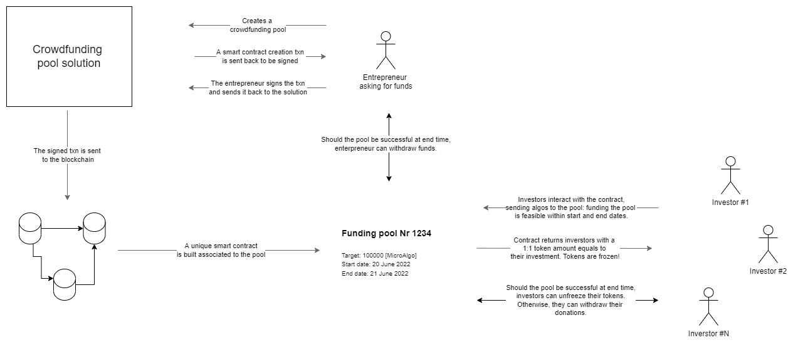
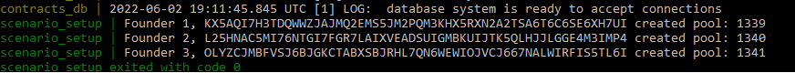

### Crowdfunding solution

<br>
The solution is defined to provide entrepreneurs a way to raise funds using a standalone smart contract built for their crowdfunding pool.<br>
Investors donate to the pool and receive in exchange tokens in the same amount of their donation. Tokens are frozen until the pool reaches its target (hard cap) and the end time.<br> 
Tokens represent a mean to certify their commitment to the pool and later on can be used as a medium to interact with the funded solution such as:

-  to access special product discounts, 
-  exclusive contents 
-  or even products, 

according to the pool promises.

<br>

<p align="center">
  
</p>

Please refer to [this](/contracts/crowdfounding/README.md) to have more info about the contract structure.

<br>
### Setup the environment


1) Setup the sandbox. Go to the sandbox folder and run

```
./sandbox reset
``` <br>
```
./sandbox up
```

2) Compose the docker

```
docker-compose up --build
```

The docker compose will start 3 containers: one sql db storing contracts' data, an API backend and a setup script, creating 3 pools from 3 users. The compose will be ready once  a similar image shows up 

<p align="center">
  
</p>

	At the time of writing the sandbox reset is needed to overcome a missed synchronization between the blockchain timestamp and the actual one. Indeed the app uses the latest_timestamp() method and it may happen that the sandbox may loose sync with the current timestamp. Should it be the case, the scenario setup will fail to work.

<br>
### Api interaction

Currently you can interact with the backend API this way:

- **get the address info** <br>
```
http://localhost:8501/address_info?address=PUBLICKEY
```

- **create a crowdfunding pool**  <br>
```
http://localhost:8501/create_contract?sender=PUBLICKEY&pool_name=prova&target=10000&startTime=1653775200&endTime=1653948000
```

	(in the case above the pool is named "prova", has a fundraising target of 10000 microalgos, with the corresponding _StartTime_ and _endTime_ will be setup by the address _PUBLICKEY_)

- **Retrieve all created contracts** <br>
```
http://localhost:8501/get_all_contracts
```


**Please notice** that in order to make it work, the algorand address asking to build the contract must have algos to pay for the transactions.
Back to the algorand folder, run


<br>
### Interact with the solution
Apart from the scenario setup, the reader can interact with the solution using the notebook 
```
usage_example.ipynb
```


